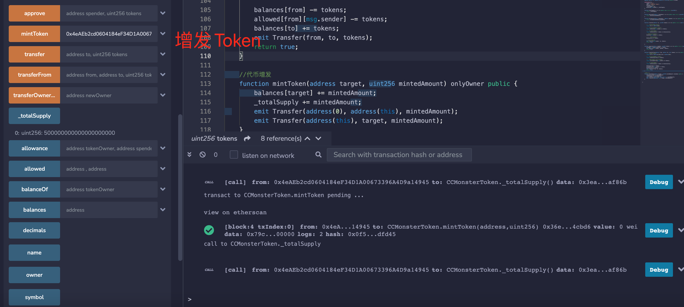
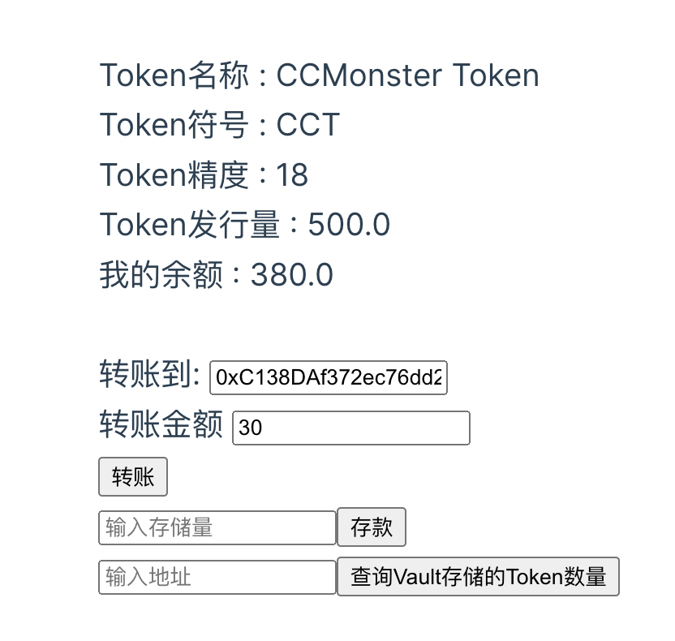
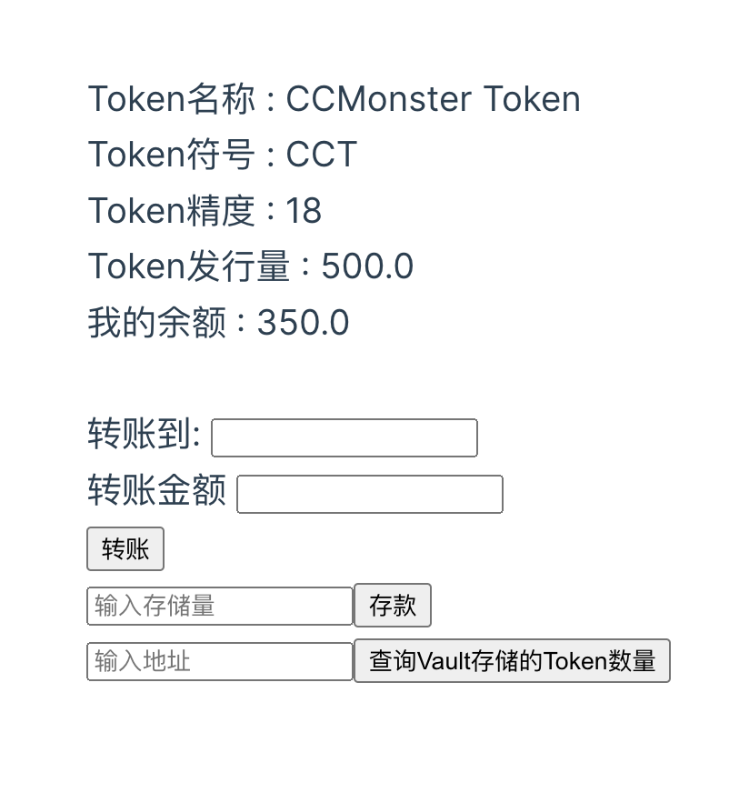
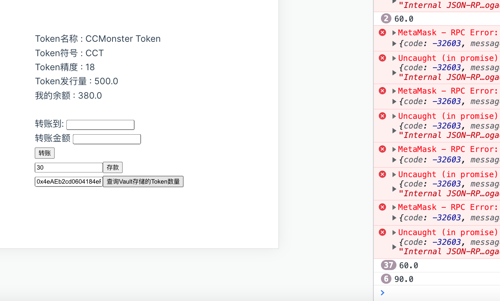

# W3-1作业

这次的作业环境为VS code + hardhat + Ganache 本地节点。

## 作业1 

代码在W3/W3-1/ERC20/contracts/CCMonsterToken.sol

增发500个

通过 ethers.js. 调⽤合约进⾏转账

转账前

转账后

## 编写一个Vault合约

代码在W3/W3-1/ERC20/contracts/Vault.sol

js代码在W3/W3-1/ERC20/vue-project/src/components/ERC20.vue

存款，然后查询。

