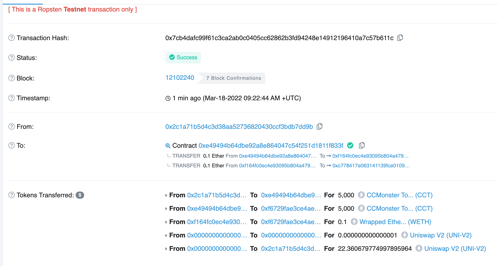
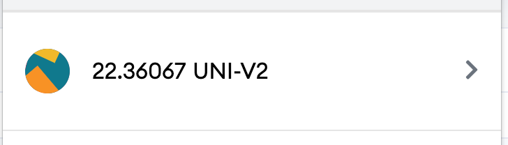
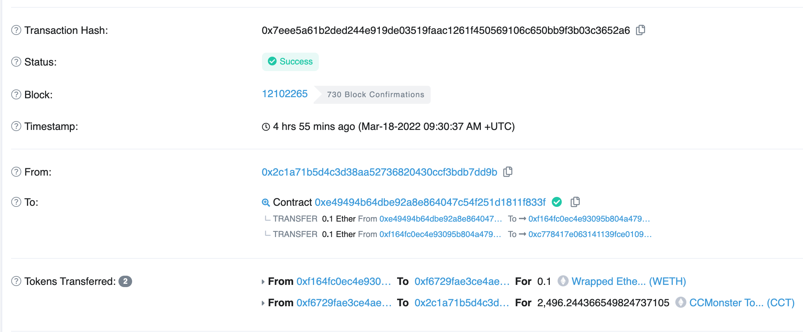

# W4-1作业

这次的作业环境为VS code + hardhat + ropsten网络

## 作业1

代码在W3/W3-1/ERC20/contracts/CCMonsterToken.sol 带初始供应量

ERC20 Token合约地址

[https://ropsten.etherscan.io/address/0x5aa9849386bd601a49a1f02f4309a1e9a197fb97](https://ropsten.etherscan.io/address/0x5aa9849386bd601a49a1f02f4309a1e9a197fb97%E2%80%B8)

MyTokenMarket合约地址

[https://ropsten.etherscan.io/address/0xe49494b64dbe92a8e864047c54f251d1811f833f](https://ropsten.etherscan.io/address/0xe49494b64dbe92a8e864047c54f251d1811f833f%E2%80%B8)

Approve Token 使用量

[https://ropsten.etherscan.io/tx/0x41045478893cd36786eaa1f5f8e1a313e33c6d367fc7e09c011e551d02d2e7b4](https://ropsten.etherscan.io/tx/0x41045478893cd36786eaa1f5f8e1a313e33c6d367fc7e09c011e551d02d2e7b4%E2%80%B8)

AddLiquidity

[https://ropsten.etherscan.io/tx/0x7cb4dafc99f61c3ca2ab0c0405cc62862b3fd94248e14912196410a7c57b611c](https://ropsten.etherscan.io/tx/0x7cb4dafc99f61c3ca2ab0c0405cc62862b3fd94248e14912196410a7c57b611c%E2%80%B8)

univ2 LP Token

buyToken

[https://ropsten.etherscan.io/tx/0x7eee5a61b2ded244e919de03519faac1261f450569106c650bb9f3b03c3652a6](https://ropsten.etherscan.io/tx/0x7eee5a61b2ded244e919de03519faac1261f450569106c650bb9f3b03c3652a6%E2%80%B8)

